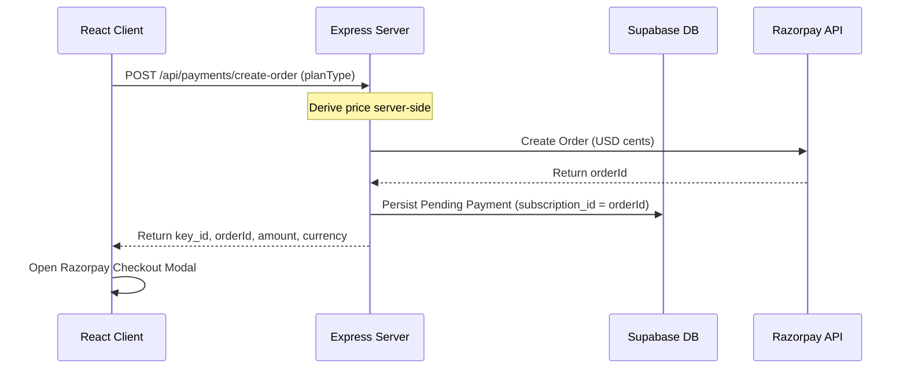

# 🛡️ Dogesh Signal V2

An AI-powered communication coach and boundary assistant designed to help professionals identify manipulation, scope creep, and urgency tactics in messages, and draft assertive, firm counter-replies.

---

## 🚀 Key Features

* **AI Message Vetting**: Real-time linguistic analysis powered by Google's Gemini models.
* **Reply Forge**: Generates three distinct, context-aware boundary drafts:
  * **Professional**: Formal, structured, and diplomatic.
  * **Bold**: Direct, assertive, and highly protective of your terms.
  * **Supportive**: Warm yet firm, maintaining positive relational alignment.
* **Dual-Storage Engine**: Secure cloud database syncing (via Supabase) with automatic fallback to client-side local browser storage.
* **Razorpay Payment Integration**: Full subscription creation, upgrade checkout, and webhook state machine (pending $\rightarrow$ active $\rightarrow$ cancelled $\rightarrow$ past due).
* **Sandbox Simulation**: Toggle-able mock payment mode for testing checkout end-to-end without real transactions.

---

## 💎 Launch Tiers & Entitlements

| Feature / Limit | Sniff (Free) | Guard ($4.99/mo or $49/yr) | Shield ($12.99/mo or $129/yr) |
| :--- | :--- | :--- | :--- |
| **Daily Scans** | 5 | 50 | 200 |
| **Monthly Scans** | 30 | 300 | 1,500 |
| **Cloud History** | None (Local only) | 500 items | 5,000 items |
| **Monthly Exports** | 0 | 50 | 500 |
| **Premium Scenarios** | 0 | 20 | 200 |

---

## 🛠️ Tech Stack & Architecture

### Frontend
* **Core**: React 19 + TypeScript + Vite.
* **Styling**: Vanilla Tailwind CSS.
* **Routing**: React Router DOM (v6).

### Backend
* **Server**: Express Node.js application (hosted in `server.ts`).
* **Database & Auth**: Supabase database schema & client authentication hooks.
* **AI Engine**: Google GenAI SDK (`@google/genai`) targeting `gemini-3.5-flash` with dynamic model selection support.
* **Payments**: Razorpay API integrations and cryptographically verified Webhooks.

---

## 🚦 Getting Started

### Prerequisites
* **Node.js** (v18+)
* **NPM** (v9+)

### Local Installation
1. Clone the repository and install dependencies:
   ```bash
   npm install
   ```
2. Create your local environment configuration file:
   ```bash
   cp .env.example .env
   ```
3. Populate `.env` with your API keys and configuration parameters:
   ```env
   # Gemini API Key
   GEMINI_API_KEY="AIzaSy..."

   # Supabase Setup (Optional fallback to mock auth/local storage if omitted)
   SUPABASE_URL="https://your-project.supabase.co"
   SUPABASE_ANON_KEY="eyJhbG..."

   # Razorpay Setup (Set mock payments to true to test checkout without credentials)
   RAZORPAY_KEY_ID="rzp_test_..."
   RAZORPAY_KEY_SECRET="your_secret"
   ALLOW_MOCK_PAYMENTS="true"
   ```

### Running the App
* **Development Server**: Starts both backend API routes and the Vite frontend proxy on `http://localhost:3000`:
  ```bash
  npm run dev
  ```
* **Run Integration Tests**: Executes payment signature, auth fallback, vetting, and history migration tests:
  ```bash
  npm test
  ```
* **Production Build**: Compiles frontend assets and bundles the Express server:
  ```bash
  npm run build
  ```

---

## 🔄 Dynamic Model Upgrades
To ensure the vetting pipeline remains unconstrained and future-proof:
* The backend does **not** hardcode a single model name.
* It dynamically resolves the target model:
  1. From the client request body payload (`req.body.model`).
  2. From the environment configuration (`process.env.GEMINI_MODEL`).
  3. Defaulting back to `"gemini-3.5-flash"` for optimum latency and efficiency.

---

## 💳 Checkout & Webhook Flows



### Webhook Event Processing
The webhook listener at `/api/webhooks/payments` handles asynchronous subscription state changes:
* **`subscription.activated` / `payment.captured`**: Matches payment signature and transitions internal database row status to `ACTIVE`.
* **`subscription.cancelled`**: Marks user subscription status as `CANCELLED`.
* **`subscription.halted`**: Flags subscription status as `PAST_DUE`.
* **Idempotency**: Webhook triggers are deduplicated via unique event transaction checks to prevent double-crediting.
